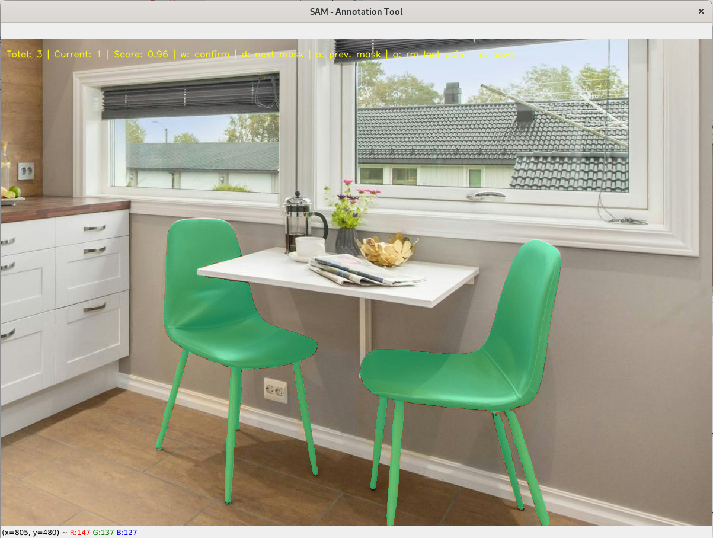

# sam_annotation_tool_GUI - Decoder Only ONNX Version

Annotation GUI tailored for efficiently annotating large batches of images using the [Segment Anything model from Meta](https://segment-anything.com/). The GUI streamlines the annotation process, allowing users to annotate numerous images in a row seamlessly.



## Installation

Before using this version of the SAM Annotation GUI, ensure that the raw images and their embeddings are stored in the `input` folder. The application expects to find the images and embeddings in this directory. Make sure the embeddings correspond to the raw images and are correctly named.

### Setting up Virtual Environment and Installing Dependencies

1. Clone the repository:
   ```sh
   git clone https://github.com/Kirscher/sam_annotation_tool_GUI/
   ```

2. Navigate to the project directory:
   ```sh
   cd sam_annotation_tool_GUI
    ```

3. Create and activate a virutal environment:
    ```sh
   python -m venv venv
   source venv/bin/activate
    ```
4. Install dependencies:
    ```sh
   pip install -r requirements.txt
    ```

## Usage

1. **Run the GUI**: In the venv, execute `python sam_GUI.py` to launch the GUI.
2. **Annotate**: Utilize the annotation tools provided to annotate images efficiently.
3. **Save Annotations**: Save the annotated images masks in compressed RLE format in `json` files in the `output/` folder.

### Commands

- **Saving Segmentation Result**:
  - Press the `s` key to save the segmentation result (if a mask has been generated).

- **Mask Selection Mode**:
  - Press the `w` key to use the model for prediction and enter the mask selection mode.
  - In the mask selection mode, you can press the `a` and `d` keys to switch between different masks.
  - Press the `s` key to save the segmentation result.
  - Press the `w` key to return to point selection mode. The model will predict based on this mask the next time.

- **Iterative optimization of selected points**:
  - Right-click on the areas you don't need and left-click on the areas you need but are not covered by the mask. A few points are enough.
